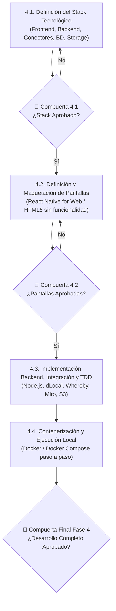

# Development Skill (Metodología: Extreme Programming - XP)

Este skill define el estándar de desarrollo de software riguroso basado en los valores fundamentales de **Extreme Programming (XP)**: Comunicación, Simplicidad, Retroalimentación, Coraje y Respeto.

## Flujo Obligatorio de la Fase de Desarrollo (4 Sub-etapas)

Para garantizar la máxima alineación con el usuario y evitar retrabajos, la fase de desarrollo se ejecuta en el siguiente orden estricto:

### Sub-etapa 4.1: Definición del Stack Tecnológico
* Especificar tecnologías para: Frontend (React Native for Web, JS, HTML5), Backend (Node.js, JS), Conectores (dLocal, Whereby, Miro, Cloudflare R2), Bases de Datos (PostgreSQL, MongoDB) y Contenedores (Docker).
* Documentar en `docs/04_tech_stack_specification.md`.
* **COMPUERTA OBLIGATORIA:** No avanzar a maquetar pantallas sin la aprobación expresa del Stack Tecnológico.

### Sub-etapa 4.2: Definición y Maquetación de Pantallas (Sin Funcionalidad)
* Diseñar y maquetar todas las pantallas del flujo completo (Landing, Búsqueda, CV sin links, Checkout Escrow, Sala Whereby 60m + Miro, Kanban con semáforo, Rating 1-5 estrellas).
* Maquetación pura en React Native for Web / HTML5 sin lógica de backend ni conectores reales.
* **COMPUERTA OBLIGATORIA:** No avanzar a la implementación backend sin la aprobación expresa de las pantallas.

### Sub-etapa 4.3: Implementación Backend, Integración y Funcionalidad (XP / TDD)
* Construcción del código backend y adaptadores bajo TDD (Red-Green-Refactor) y Clean Architecture.
* Integración de la UI con los servicios y conectores externos.

### Sub-etapa 4.4: Contenerización y Ejecución Local
* Configuración de `Dockerfile` y `docker-compose.yml`.
* Elaboración de guía paso a paso para levantar localmente el frontend, backend y bases de datos con un único comando.

---

## Puertas de Calidad (Quality Gates)
* **Gate 4.1:** Aprobación del Stack Tecnológico.
* **Gate 4.2:** Aprobación de la Maquetación de Pantallas.
* **Gate 4.3/4.4:** Aprobación del Software Funcionando y Contenedores Locales.
