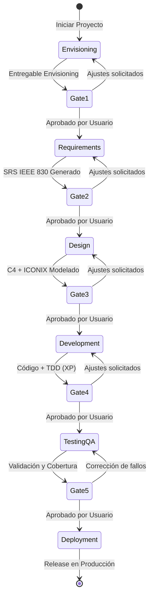

# SDLC Orchestrator Skill

Controlador central del ciclo de vida del desarrollo de software. Supervisa el flujo de trabajo secuencial entre fases, asegurando que se cumplan las puertas de calidad (*quality gates*).

## Flujo de Estados del Ciclo de Vida

## Procedimiento de Orquestación

1. **Identificar Fase Actual:**
   - Consultar el estado de los issues en GitHub Projects (`plataforma01`) o el archivo `docs/sdlc_status.md`.
2. **Asignación e Inicio:**
   - Mover el issue de la fase correspondiente a `In Progress` en el tablero Kanban.
   - Asignar a `pcloayza3`.
   - Crear o cambiar a la rama GitFlow correspondiente (`feature/<fase>-...`).
3. **Ejecución del Skill Especializado:**
   - Delegar o ejecutar el skill de la fase con rigor metodológico y verificación de fuentes reales (cero alucinación).
4. **Presentación de Entregable y Puerta de Calidad:**
   - Presentar resumen conciso del artefacto o entregable generado.
   - **DETENERSE OBLIGATORIAMENTE.** No continuar a la siguiente fase bajo ninguna circunstancia sin respuesta explícita.
5. **Transición:**
   - Con aprobación del usuario: Marcar issue en `Done` en el Kanban, integrar rama en `develop` vía GitFlow, y habilitar la fase subsiguiente.
