# Documento de Arquitectura y Diseño de Software (C4 Model + ICONIX)

## 1. Introducción y Enfoque Metodológico
Este documento formaliza el diseño técnico y arquitectónico de `plataforma01`, integrando:
1. **C4 Model:** Representación estática y jerárquica de la arquitectura (Contexto, Contenedores y Componentes).
2. **ICONIX Process:** Conexión dinámica entre requisitos (IEEE 830) y código ejecutable mediante Modelado de Dominio, Análisis de Robustez y Diagramas de Secuencia.
3. **Patrones de Software:** Clean Architecture (Hexagonal), Gateway/Adapter, Strategy, Repository y Sanitizer/Filter.

---

## 2. C4 Model - Arquitectura de Software

### 2.1 C4 - Nivel 1: Diagrama de Contexto del Sistema
Define los límites del sistema, los usuarios y los servicios externos con los que interactúa.

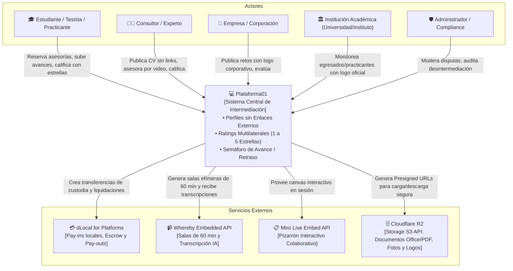

---

### 2.2 C4 - Nivel 2: Diagrama de Contenedores
Descompone el sistema en aplicaciones ejecutables, microservicios y almacenes de datos.

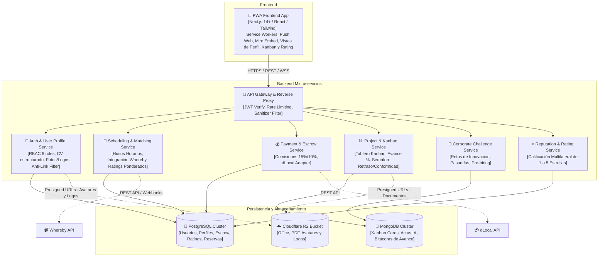

---

### 2.3 C4 - Nivel 3: Componentes de Perfil y Sanitización (`auth-user-profile-service`)
Garantiza el cumplimiento estricto de la política de cero enlaces externos.

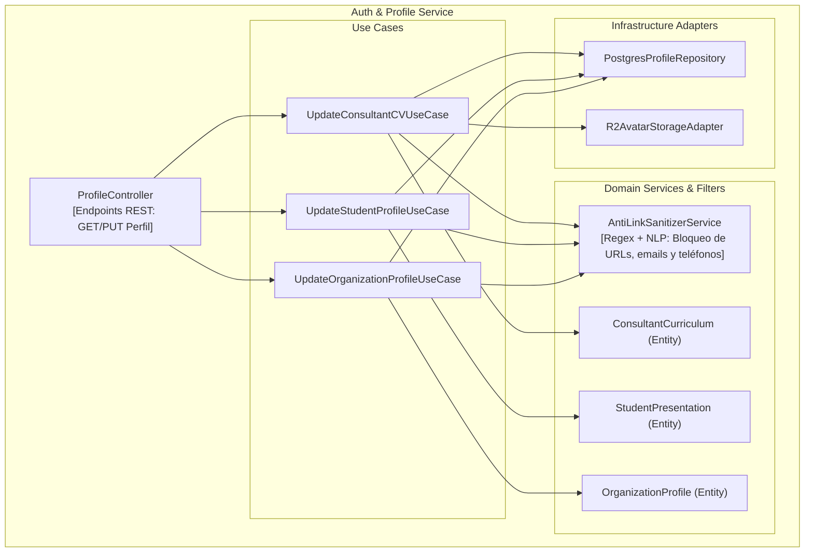

---

## 3. ICONIX Process - Dinámica del Software

### 3.1 Modelo de Dominio (Domain Model Expandido)
Entidades centrales, perfiles, métricas de avance y calificaciones:

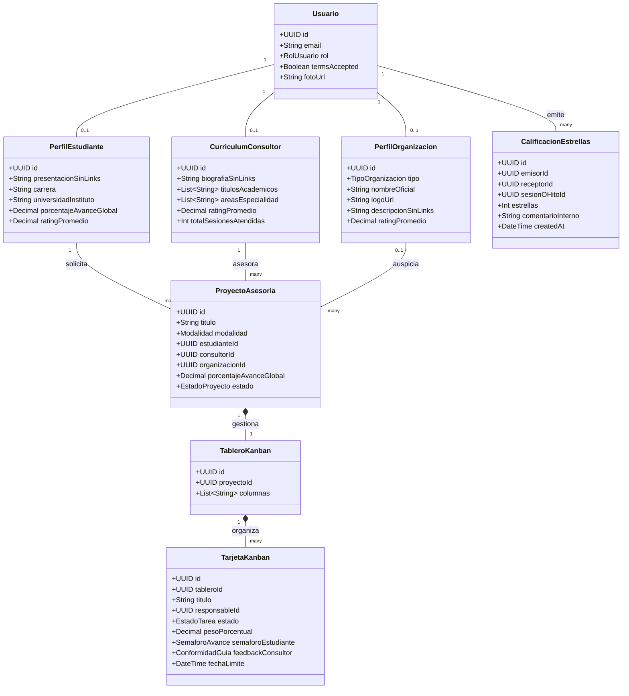

---

### 3.2 Diagrama de Robustez: Calificación Post-Sesión (1 a 5 Estrellas)

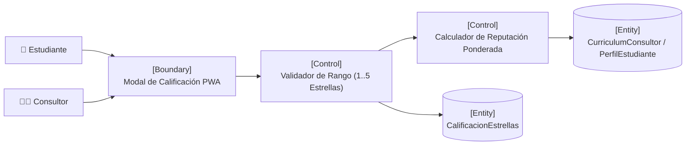

---

### 3.3 Diagrama de Robustez: Cálculo de Avance Porcentual y Semáforo de Conformidad

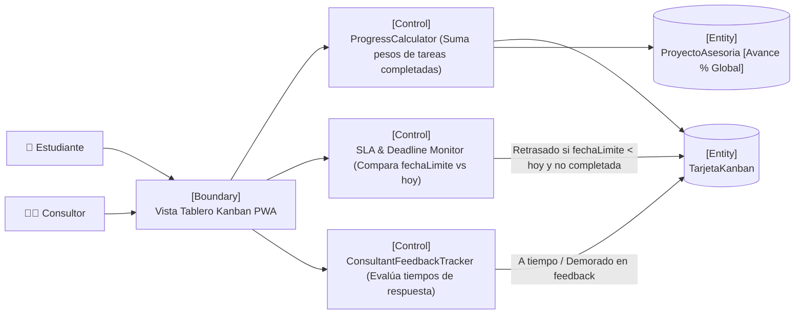

---

### 3.4 Diagrama de Secuencia: Finalización de Videollamada, Calificación Multilateral y Actualización de Avance

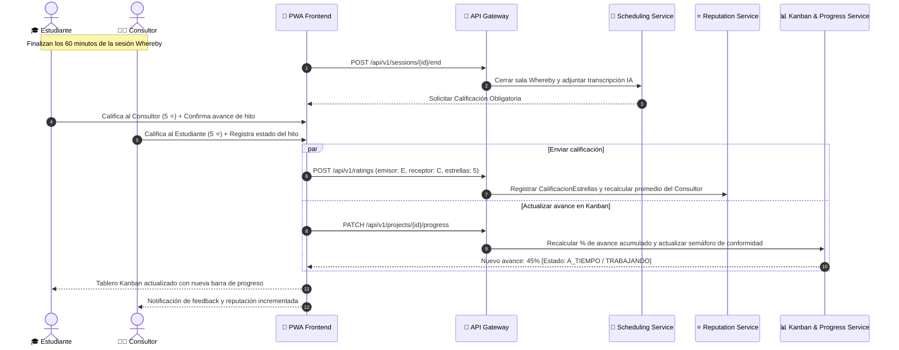

---

### 3.5 Ciclo Operativo Completo: Flujo End-to-End Subdividido en Etapas Continuas

El ciclo de vida de la interacción entre el estudiante y el consultor se divide en 5 etapas secuenciales gobernadas por el motor de custodia (*Escrow*), el agendamiento y el tablero Kanban:

---

#### 3.5.1 Etapa 1: Búsqueda, Filtrado y Enlace (Matching)
* **Descripción:** El estudiante busca expertos filtrando por área de especialidad, carrera y reputación. Revisa el perfil y CV estructurado del consultor (**sin enlaces externos**). Acuerdan los hitos del proyecto y se crea el `ProyectoAsesoria` con su `TableroKanban` asociado.

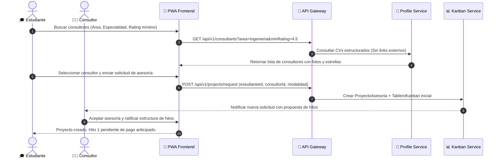

---

#### 3.5.2 Etapa 2: Pago por Adelantado y Resguardo en Custodia (Escrow Pay-In)
* **Regla de Negocio Mandatoria:** Para iniciar cualquier hito, el estudiante debe pagar por adelantado (por hito individual o la totalidad del proyecto). La plataforma retiene y resguarda los fondos en estado `EN_CUSTODIA` durante todo el desarrollo. Se deduce la comisión dinámica (**15% < 300 BOB** o **10% ≥ 300 BOB**). Ningún dinero sale hacia el consultor en esta fase.

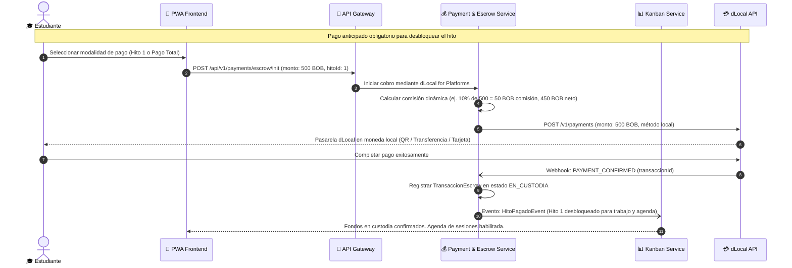

---

#### 3.5.3 Etapa 3: Sesión de Videollamada (Whereby 60 min + Miro) y Calificación con Estrellas
* **Descripción:** Con los fondos resguardados por adelantado, se habilita la agenda. El estudiante reserva la sesión; el sistema genera una sala efímera de **60 minutos en Whereby Embedded API** con pizarra interactiva en **Miro**. Al finalizar, la IA de Whereby transcribe la sesión y ambos participantes realizan la **calificación obligatoria de 1 a 5 estrellas**.

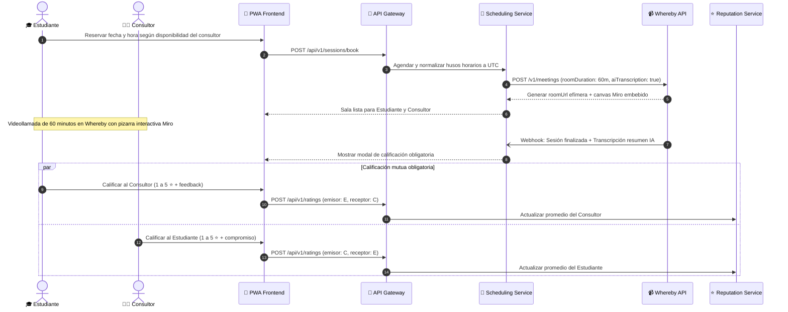

---

#### 3.5.4 Etapa 4: Ejecución, Seguimiento en Kanban y Repositorio Documental
* **Descripción:** El estudiante trabaja en los avances y sube los documentos al repositorio protegido (Cloudflare R2 vía Presigned URLs, limitado a formatos Office/PDF de máx. 25 MB). La tarjeta del Kanban refleja el semáforo de tiempo (*A tiempo / Trabajando* vs *Retrasado*). El consultor revisa el avance y registra su conformidad.

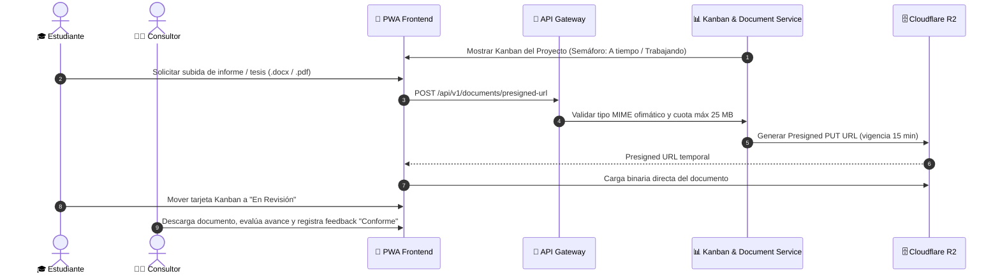

---

#### 3.5.5 Etapa 5: Validación, Aprobación de Hito y Liquidación al Consultor (Escrow Pay-Out)
* **Descripción:** El estudiante verifica la conformidad del hito y presiona `Aprobar Hito`. La tarjeta pasa a `Completada`, el porcentaje de avance del proyecto se recalcula y el motor de custodia dispara automáticamente la transferencia del monto neto de ese hito a la cuenta bancaria local del consultor mediante dLocal. Para pasar al hito siguiente, se comprueba si ya fue cubierto en el pago inicial o se solicita el nuevo pago anticipado.

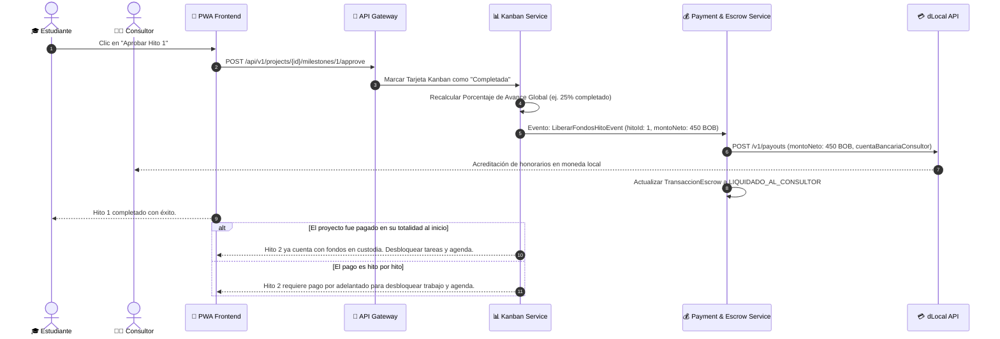

---

## 4. Patrones de Arquitectura y Diseño Aplicados

| Patrón | Capa / Módulo | Justificación Técnica |
| :--- | :--- | :--- |
| **Sanitizer / Interceptor Filter** | `auth-user-profile-service` | Detecta e intercepta enlaces externos, teléfonos y correos en perfiles de consultores, estudiantes y empresas para prevenir la desintermediación. |
| **Strategy Pattern** | `payment-escrow-service` y `reputation-rating-service` | Encapsula el cálculo de comisiones dinámicas y la ponderación matemática del rating de estrellas (Bayesian Average). |
| **Clean Architecture (Hexagonal)** | Todos los Microservicios | Desacopla reglas de negocio centrales de bases de datos y APIs externas. |
| **Gateway / Adapter Pattern** | Integraciones (`dLocal`, `Whereby`, `Miro`, `Cloudflare R2`) | Oculta los detalles del SDK externo tras una interfaz del dominio. |
| **Observer / Event-Driven** | `scheduling-service` y `reputation-service` | Al concluir la sesión Whereby, dispara automáticamente los eventos de solicitud de rating y recalculo de progreso en el Kanban. |
