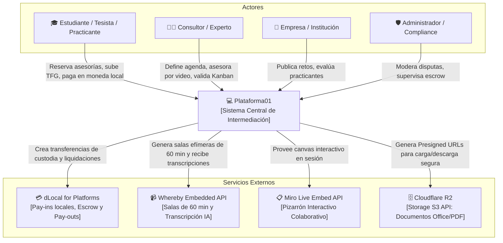
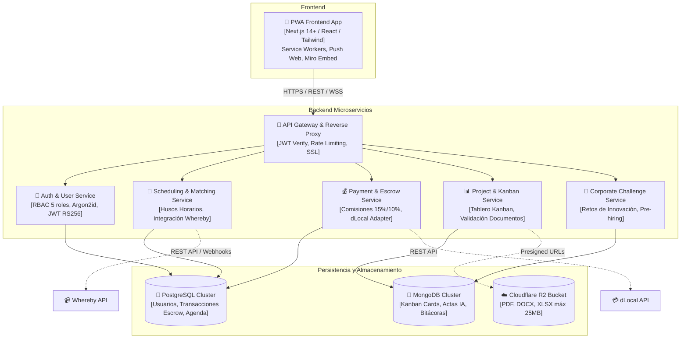
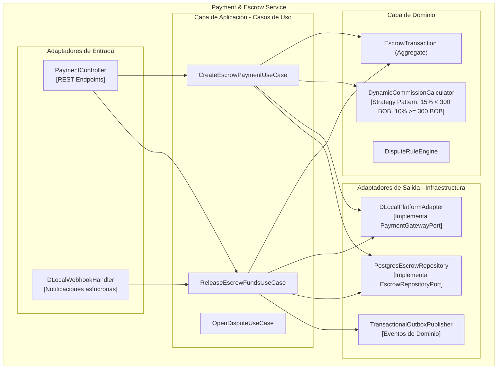
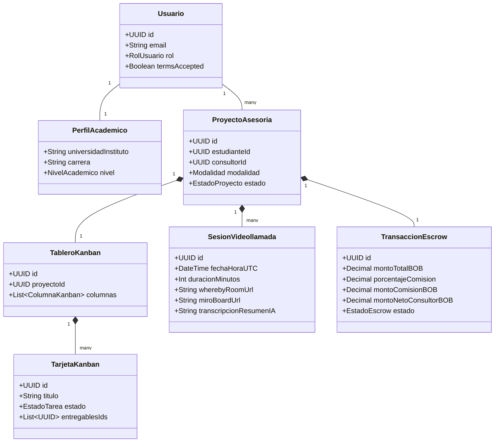
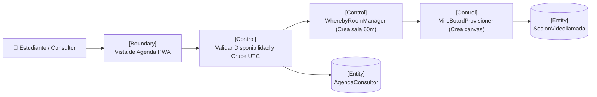
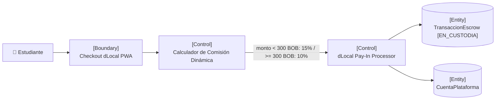
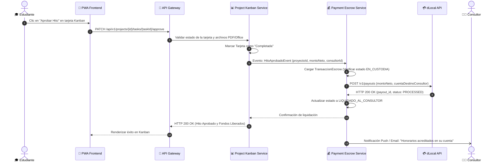

# Documento de Arquitectura y Diseño de Software (C4 Model + ICONIX)

## 1. Introducción y Enfoque Metodológico
Este documento formaliza el diseño técnico y arquitectónico de `plataforma01`, integrando:
1. **C4 Model:** Representación estática y jerárquica de la arquitectura (Contexto, Contenedores y Componentes).
2. **ICONIX Process:** Conexión dinámica entre requisitos (IEEE 830) y código ejecutable mediante Modelado de Dominio, Análisis de Robustez y Diagramas de Secuencia.
3. **Patrones de Software:** Clean Architecture (Hexagonal), Gateway/Adapter, Strategy y Repository.

---

## 2. C4 Model - Arquitectura de Software

### 2.1 C4 - Nivel 1: Diagrama de Contexto del Sistema
Define los límites del sistema, los usuarios y los servicios externos con los que interactúa.

---

### 2.2 C4 - Nivel 2: Diagrama de Contenedores
Descompone el sistema en aplicaciones ejecutables, microservicios y almacenes de datos.

---

### 2.3 C4 - Nivel 3: Diagrama de Componentes (`payment-escrow-service`)
Estructurado estrictamente bajo **Clean Architecture / Arquitectura Hexagonal**.

---

## 3. ICONIX Process - Dinámica del Software

### 3.1 Modelo de Dominio (Domain Model)
Entidades centrales, agregados y sus relaciones directas:

---

### 3.2 Diagrama de Robustez: Reserva de Videollamada (Whereby + Miro)
Conecta la UI de agenda con la creación de la sala interactiva de 60 minutos.

---

### 3.3 Diagrama de Robustez: Procesamiento de Escrow y Comisiones Dinámicas

---

### 3.4 Diagrama de Secuencia: Aprobación de Hito en Kanban y Dispersión (*Pay-out*)

---

## 4. Patrones de Arquitectura y Diseño Seleccionados

| Patrón | Capa / Módulo | Justificación Técnica |
| :--- | :--- | :--- |
| **Clean Architecture (Hexagonal)** | Todos los Microservicios | Aísla la lógica de negocio central de los frameworks, bases de datos y APIs externas. Facilita pruebas TDD puras. |
| **Strategy Pattern** | `payment-escrow-service` | Encapsula el algoritmo de comisión dinámica (`15% < 300 BOB` y `10% ≥ 300 BOB`), permitiendo incorporar nuevas reglas tarifarias sin modificar el Aggregate de Escrow. |
| **Gateway / Adapter Pattern** | Integraciones (`dLocal`, `Whereby`, `Miro`, `Cloudflare R2`) | Oculta los detalles del SDK externo tras una interfaz/puerto propio del dominio, posibilitando sustituir proveedores sin impacto en el núcleo. |
| **Repository Pattern** | Capa de Infraestructura | Desacopla la persistencia física (SQL / NoSQL) de los agregados del dominio, facilitando el uso de mocks en TDD. |
| **Transactional Outbox** | Consistencia entre microservicios | Garantiza que la aprobación en el Kanban y la dispersión del Escrow sean atómicas y tolerantes a caídas de red asíncronas. |
| **Presigned URL Pattern** | `project-kanban-service` y Cloudflare R2 | Descarga al servidor de backend del tráfico de archivos binarios; el navegador interactúa directamente con el bucket S3 bajo credenciales efímeras seguras. |
