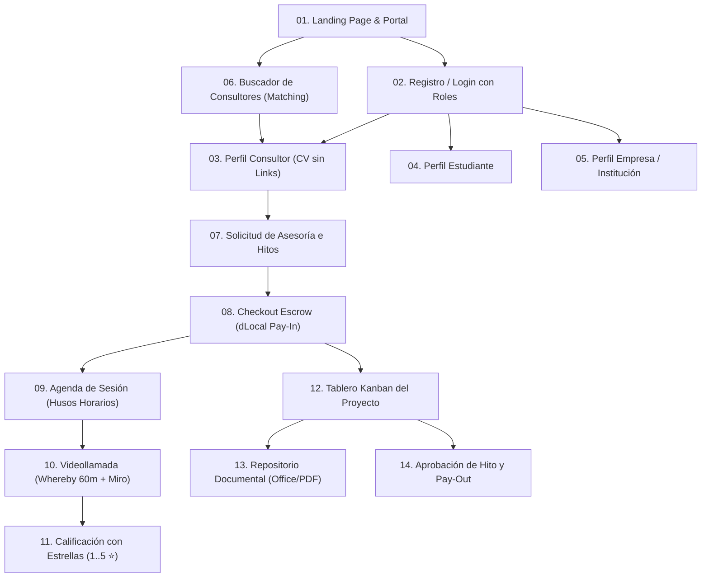

# Especificación y Maquetación de Pantallas del Flujo Completo (Sub-etapa 4.2)

Este documento define la arquitectura visual, estructura de componentes y navegación de todas las pantallas que componen la interfaz PWA de `plataforma01` construida con **React Native for Web** y **HTML5**, sin funcionalidad ni backend activo, listas para revisión y aprobación.

---

## 1. Mapa de Navegación del Flujo Completo

---

## 2. Catálogo Detallado de Pantallas

### Pantalla 01: Landing Page & Portal Principal
* **Propósito:** Presentación del ecosistema para estudiantes, consultores, empresas e institutos.
* **Componentes Visuales:**
  * Header con logo institucional y botones `Iniciar Sesión` y `Registrarse`.
  * Hero Section con propuesta de valor para TFG pregrado, tesis posgrado y pasantías.
  * Selector de perfiles (Estudiante, Experto, Empresa).
  * Banner informativo: Pagos en custodia local (*Escrow*), videollamadas de 60 min y protección de autoría.

### Pantalla 02: Registro e Inicio de Sesión (RBAC)
* **Propósito:** Acceso seguro identificando el rol del usuario.
* **Componentes Visuales:**
  * Selector de rol mediante tarjetas visuales (Estudiante Pregrado, Posgrado, Consultor, Empresa, Universidad).
  * Campos: Email institucional/personal, contraseña, confirmación.
  * Checkbox de aceptación vinculante de **Políticas de Uso y Prevención de Desintermediación**.

### Pantalla 03: Perfil Estructurado del Consultor (Sin Enlaces Externos)
* **Propósito:** Vitrina profesional y académica del consultor protegiendo el ecosistema contra desintermediación.
* **Componentes Visuales:**
  * Foto de perfil circular y medalla de verificación.
  * Promedio de reputación destacado con estrellas (ej. `4.9 ⭐ [42 asesorías]`).
  * Grados académicos y universidades de egreso.
  * Áreas temáticas de experticia y metodologías dominadas.
  * Banda tarifaria por sesión de 60 minutos (ej. `250 BOB / sesión`).
  * Biografía profesional con sanitización activa (cero URLs, emails ni teléfonos).
  * Botón de acción principal: `Solicitar Asesoría`.

### Pantalla 04: Perfil del Estudiante / Practicante
* **Propósito:** Identidad académica y seguimiento de progreso del estudiante.
* **Componentes Visuales:**
  * Foto de perfil, carrera, universidad o instituto.
  * Nivel académico (Pregrado / Posgrado) y tema de titulación.
  * Barra de progreso global del proyecto (`0%` a `100%`).
  * Historial de hitos y calificaciones recibidas.

### Pantalla 05: Perfil Institucional y Corporativo
* **Propósito:** Espacio para empresas e instituciones académicas.
* **Componentes Visuales:**
  * Logo corporativo / institucional.
  * Sector industrial o facultades académicas.
  * Catálogo de retos de innovación y plazas de pasantía abiertas.

### Pantalla 06: Directorio y Buscador de Consultores (Matching)
* **Propósito:** Filtrado y selección de expertos disponibles.
* **Componentes Visuales:**
  * Barra de búsqueda por palabra clave y carrera.
  * Filtros laterales: Área temática, nivel (Tesis Licenciatura, Maestría, Doctorado), tarifa y estrellas mínimas.
  * Grilla de tarjetas de consultores con foto, badges de experticia, tarifa por hora y botón `Ver Perfil`.

### Pantalla 07: Solicitud de Asesoría y Desglose de Hitos
* **Propósito:** Estructuración del proyecto entre estudiante y consultor.
* **Componentes Visuales:**
  * Modalidad seleccionada (`tesis_pregrado`, `tesis_posgrado`, `practica_profesional`).
  * Título del proyecto y descripción del alcance formativo.
  * Tabla de Hitos acordados: Nombre del hito, peso porcentual (ej. Hito 1: 30%), fecha estimada y monto en BOB.
  * Resumen del costo total y botón `Enviar Propuesta de Proyecto`.

### Pantalla 08: Checkout de Pago Anticipado en Custodia (Escrow dLocal)
* **Propósito:** Pasarela de pago previo obligatorio para habilitar el trabajo.
* **Componentes Visuales:**
  * Selector de modalidad: `Pagar Solo Hito 1` vs `Pagar Totalidad del Proyecto por Adelantado`.
  * Desglose financiero transparente: Monto bruto en BOB, deducción de comisión dinámica de la plataforma (15% si < 300 BOB o 10% si ≥ 300 BOB) y monto neto en custodia.
  * Métodos de pago locales (dLocal): Pago con Código QR, Transferencia Bancaria Local, Tarjeta de Débito/Crédito.
  * Badge de seguridad: *"Fondos resguardados en custodia. No se transfieren al consultor hasta que apruebes el hito."*
  * Botón `Confirmar Pago en Custodia`.

### Pantalla 09: Agenda y Reserva de Sesiones
* **Propósito:** Selección de fecha y hora para la videollamada de 60 minutos.
* **Componentes Visuales:**
  * Calendario mensual y selector de franjas horarias disponibles del consultor.
  * Indicador de zona horaria del usuario con conversión automática a UTC.
  * Botón `Confirmar Reserva de Sesión`.

### Pantalla 10: Sala de Videollamada (Whereby 60m + Miro)
* **Propósito:** Espacio interactivo de asesoría en tiempo real.
* **Componentes Visuales:**
  * Header de la sesión con temporizador regresivo de 60 minutos (alerta visual en los últimos 5 minutos).
  * Panel izquierdo / superior: Frame embebido de **Whereby** (video/audio WebRTC de alta calidad).
  * Panel derecho / inferior: Canvas colaborativo interactivo de **Miro** incrustado para diagramación y revisión.
  * Indicador: *"Transcripción inteligente activa (Whereby AI)"*.
  * Botón `Finalizar Sesión`.

### Pantalla 11: Modal de Calificación Multilateral (1 a 5 Estrellas)
* **Propósito:** Evaluación mutua obligatoria al concluir cada videollamada o hito.
* **Componentes Visuales:**
  * Selector interactivo de 1 a 5 estrellas con iconos de feedback.
  * Área de texto para observaciones cualitativas.
  * Botón `Enviar Calificación Obligatoria`.

### Pantalla 12: Tablero Kanban Colaborativo de Seguimiento
* **Propósito:** Gestión y visibilidad del avance del proyecto en tiempo real.
* **Componentes Visuales:**
  * Barra superior de avance porcentual global del proyecto (ej. `[████████░░░░░░░░] 45% Completado`).
  * 4 columnas Kanban: `Por Hacer`, `En Progreso`, `En Revisión`, `Completada`.
  * Tarjetas de hito con: Título, peso %, fecha límite, **semáforo de entrega** (*Verde: A tiempo / Trabajando*, *Rojo: Retrasado*) y **semáforo de feedback del consultor** (*Conforme* vs *Demorado*).
  * Botón en tarjeta: `Subir Avance Documental`.

### Pantalla 13: Repositorio Documental del Proyecto
* **Propósito:** Carga y descarga de archivos de tesis y acuerdos con validación de tipo.
* **Componentes Visuales:**
  * Zona de carga Drag & Drop restringida estrictamente a formatos `.pdf`, `.docx`, `.xlsx`, `.pptx` (máximo 25 MB).
  * Lista de archivos adjuntos con fecha, tamaño, versión y enlace de descarga temporal seguro.

### Pantalla 14: Aprobación de Hito y Liquidación al Consultor (Pay-Out)
* **Propósito:** Validación final del entregable y liberación de fondos de custodia.
* **Componentes Visuales:**
  * Resumen del hito completado, observaciones del consultor y actas de sesión asociadas.
  * Checkbox de conformidad del estudiante.
  * Botón principal destacado: `Aprobar Hito y Liberar Fondos`.
  * Mensaje de confirmación: *"Se ha transferido el monto neto de XXX BOB a la cuenta local del consultor. El Hito siguiente ha sido desbloqueado."*
