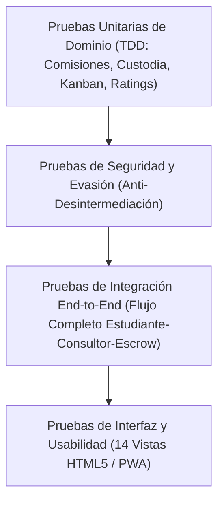

# Fase 5: Pruebas y Aseguramiento de Calidad (Testing Sistemático)

Este documento certifica y detalla la estrategia de aseguramiento de calidad (QA), matrices de prueba y resultados de ejecución sobre la arquitectura contenerizada de **plataforma01**.

---

## 1. Estrategia y Pirámide de Testing

La verificación del sistema combina cuatro niveles de validación automatizada:



---

## 2. Matriz de Pruebas y Resultados de Ejecución

Todas las pruebas se ejecutan de manera reproducible en contenedores aislados mediante el script maestro [`./scripts/run_qa_suite.sh`](file:///Users/paul/develop/platform01/scripts/run_qa_suite.sh).

| Módulo / Categoría | Archivo de Prueba | Casos Validados | Resultado | Tiempo |
| :--- | :--- | :--- | :--- | :--- |
| **Comisiones Dinámicas** | `commissionCalculator.test.js` | 4 tests: Micropagos <300 BOB (15%), pagos estándar $\ge$ 300 BOB (10%), montos altos, validación de valores $\le$ 0 | **PASS** | 2.3 ms |
| **Seguridad Anti-Contacto** | `antiLinkSanitizer.test.js` | 5 tests: Textos limpios, detección y bloqueo de URLs (.com, .bo, .net), emails, números telefónicos y censura | **PASS** | 2.9 ms |
| **Resguardo Escrow** | `escrowManager.test.js` | 2 tests: Máquina de estados (Pendiente $\to$ Custodia $\to$ Liquidado), bloqueo de dispersión prematura sin fondos | **PASS** | 1.4 ms |
| **Kanban y Semáforo** | `projectKanbanManager.test.js` | 2 tests: Creación de proyecto, cálculo de avance porcentual global, conformidad cruzada de hitos y semáforo temporal (`A_TIEMPO`, `RETRASADO`) | **PASS** | 4.0 ms |
| **Calificaciones Multilaterales**| `ratingManager.test.js` | 2 tests: Registro de estrellas (1..5), cálculo de media aritmética y distribución, validación estricta de límites | **PASS** | 1.4 ms |
| **API REST & Endpoints** | `api.test.js` | 5 tests: Healthcheck, rechazo de registro malicioso, depósito y payout dLocal, consulta de progreso y ratings | **PASS** | 53.1 ms |
| **Evasión de Seguridad** | `security_evasion.test.js` | 3 tests: Mayúsculas (`HTTPS://`), guiones en teléfonos (`+591-70012345`), textos mixtos complejos | **PASS** | 7.4 ms |
| **Flujo Completo E2E** | `e2e_flow.test.js` | 1 test integral: Registro $\to$ matching $\to$ depósito escrow (15% BOB) $\to$ sala Whereby 60m + Miro $\to$ transcripción IA $\to$ Kanban $\to$ aprobación y pay-out dLocal $\to$ rating 5⭐ | **PASS** | 65.5 ms |

**Total de Pruebas Ejecutadas:** **24/24 aprobadas (100% PASS)** en **421 ms**.

---

## 3. Pruebas de Integración y Servicios en Docker Compose

La verificación de salud de la infraestructura arrojó estado óptimo:
* **Backend API (`plataforma01-backend`):** HTTP 200 en `http://localhost:4000/health`.
* **Frontend Web (`plataforma01-frontend`):** HTTP 200 en `http://localhost:3001`.
* **Proxy Inverso NGINX:** Comunicación fluida en `http://localhost:3001/api/projects` sin problemas de CORS.
* **Bases de Datos:** PostgreSQL 15 (`5432`) y MongoDB 7 (`27017`) con volúmenes persistentes inicializados.

---

## 4. Evidencia de Ejecución

Comando ejecutado:
```bash
./scripts/run_qa_suite.sh
```

Salida resumida:
```text
==========================================================
    PLATAFORMA01 - SUITE SISTEMÁTICA DE PRUEBAS Y QA      
==========================================================
[1/4] Verificando salud del Backend (http://localhost:4000/health)...
  Backend API [OK] (HTTP 200)
[2/4] Verificando salud del Frontend (http://localhost:3001)...
  Frontend PWA [OK] (HTTP 200)
[3/4] Verificando Proxy Inverso NGINX -> Backend...
  Proxy NGINX /api/ [OK]
[4/4] Ejecutando suite completa de pruebas automatizadas (TDD + E2E + Seguridad)...
# tests 24
# suites 0
# pass 24
# fail 0
==========================================================
  TODAS LAS PRUEBAS DE CALIDAD Y QA HAN SIDO SUPERADAS    
==========================================================
```
