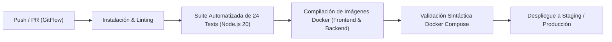

# Fase 6: Despliegue y Mantenimiento (GitFlow & CI/CD)

Este documento define las políticas operativas, arquitectura de despliegue continuo (CI/CD), procedimientos de respaldo, contingencia y mantenimiento del ecosistema **plataforma01**.

---

## 1. Pipeline de Integración y Despliegue Continuo (CI/CD)

El repositorio cuenta con la especificación de automatización CI/CD en [`ci/ci.yml`](file:///Users/paul/develop/platform01/ci/ci.yml) diseñada para ejecutarse en GitHub Actions en cada push y pull request a `main`, `develop` y ramas `release/**`:



### Etapas del Pipeline:
1. **Verificación de Código y Dependencias:** Validación con `npm ci` en ambiente Node.js 20.
2. **Testing Exhaustivo:** Ejecución de 24 pruebas automatizadas (TDD, seguridad anti-desintermediación y flujo E2E).
3. **Build de Imágenes Docker:** Construcción de imágenes Docker multipropósito (`plataforma01-backend:ci` y `plataforma01-frontend:ci`) con cache optimizado.
4. **Validación de Orquestación:** Certificación de sintaxis de `docker compose config`.

---

## 2. Estrategia de Versionado Semántico (SemVer 2.0.0)

El proyecto utiliza la convención `MAJOR.MINOR.PATCH`:
* **MAJOR (v1.0.0):** Versión inicial estable del ecosistema completo de intermediación académica, escrow, videollamadas y Kanban.
* **MINOR (v1.1.0):** Nuevas integraciones funcionales o conectores (ej. pasarelas adicionales de pago, herramientas externas).
* **PATCH (v1.0.1):** Correcciones urgentes de seguridad (*hotfixes*) o mejoras cosméticas.

---

## 3. Políticas de Respaldo y Recuperación ante Desastres (DRP)

* **Objetivo de Punto de Recuperación (RPO):** $\le$ 1 hora.
* **Objetivo de Tiempo de Recuperación (RTO):** $\le$ 15 minutos.
* **Herramienta Automatizada:** [`scripts/db_backup.sh`](file:///Users/paul/develop/platform01/scripts/db_backup.sh)
  * **PostgreSQL (`plataforma01_db`):** Volcado SQL consistente con `pg_dump` para transacciones, usuarios, hitos y balances de custodia.
  * **MongoDB (`plataforma01_logs`):** Exportación BSON con `mongodump` para registros de auditoría y transcripciones IA.

### Procedimiento de Restauración Rápida:
```bash
# Restaurar PostgreSQL
docker exec -i plataforma01-postgres psql -U platuser -d plataforma01_db < backups/<fecha>/postgres_dump.sql

# Restaurar MongoDB
docker exec -i plataforma01-mongo mongorestore --username platuser --password platpassword --authenticationDatabase admin /tmp/mongodump
```

---

## 4. Política de Rollback Inmediato

En caso de incidentes críticos o anomalías en producción:
1. **Rollback de Imágenes Docker:** Revertir la etiqueta del contenedor a la versión estable previa (`v1.0.0-previous`):
   ```bash
   docker compose down
   docker compose up -d --build
   ```
2. **Rollback en GitFlow:**
   * Crear rama `hotfix/<incidente>` desde `main`.
   * Aplicar el parche, ejecutar `./scripts/run_qa_suite.sh`.
   * Integrar el hotfix simultáneamente en `main` y en `develop`.

---

## 5. Monitoreo y Mantenimiento Preventivo

* **Healthcheck de API:** Monitoreo continuo mediante endpoint `/health` con tiempo de actividad (*uptime*) y estado de servicios.
* **Rotación de Logs:** Almacenamiento rotativo de logs en MongoDB para evitar saturación de disco.
* **Depuración de Archivos Temporales:** Purgado semanal de presigned URLs caducadas en Cloudflare R2.
