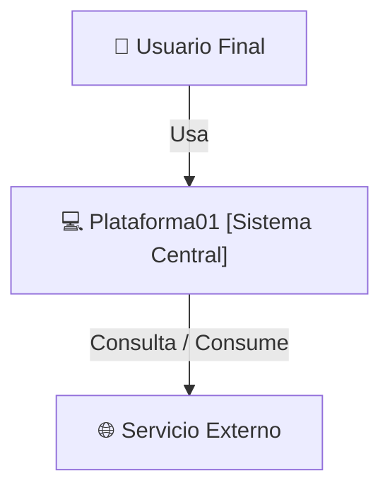
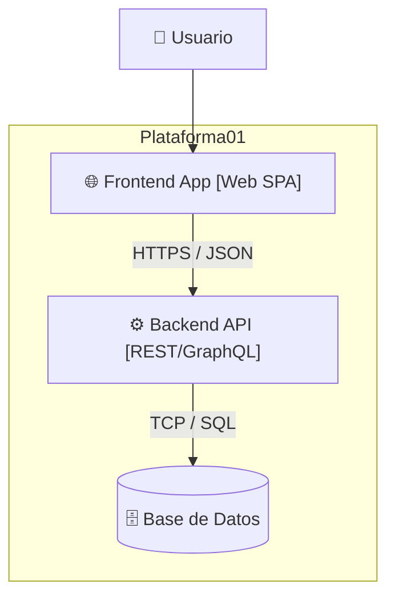
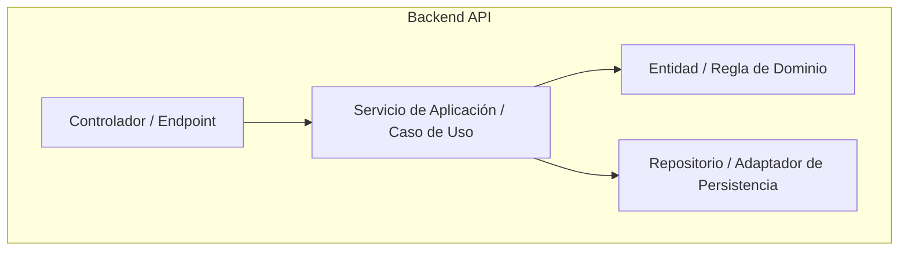

# Documento de Arquitectura de Software - C4 Model

## 1. Patrón Arquitectónico Seleccionado
* **Patrón:** [e.g., Clean Architecture / Hexagonal / Microservicios]
* **Justificación Técnica:** [Razón de la elección frente a los requisitos del sistema]

---

## 2. C4 - Nivel 1: Diagrama de Contexto del Sistema
Representa los límites del sistema, quién lo usa y con qué otros sistemas interactúa.

---

## 3. C4 - Nivel 2: Diagrama de Contenedores
Desglose en aplicaciones ejecutables, bases de datos y servicios.

---

## 4. C4 - Nivel 3: Diagrama de Componentes (Backend API)
Desglose modular interno del contenedor principal siguiendo Clean Architecture.

---

## 5. Patrones de Diseño Aplicados
| Patrón (GoF / Clean) | Ubicación | Justificación |
| :--- | :--- | :--- |
| **Repository** | Capa de Infraestructura / Persistencia | Desacoplar la lógica de dominio del motor de base de datos. |
| **Factory / DI** | Contenedor de Inyección | Instanciación desacoplada y facilitación de pruebas unitarias. |
| **Strategy** | Lógica de cálculo o validación | Intercambiar algoritmos en tiempo de ejecución de forma limpia. |
