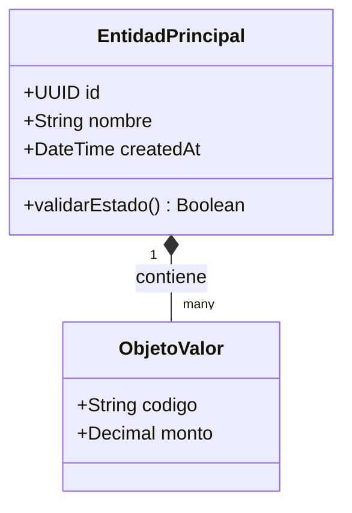
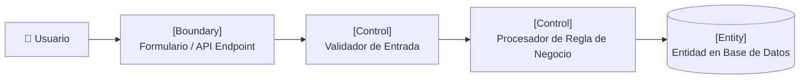
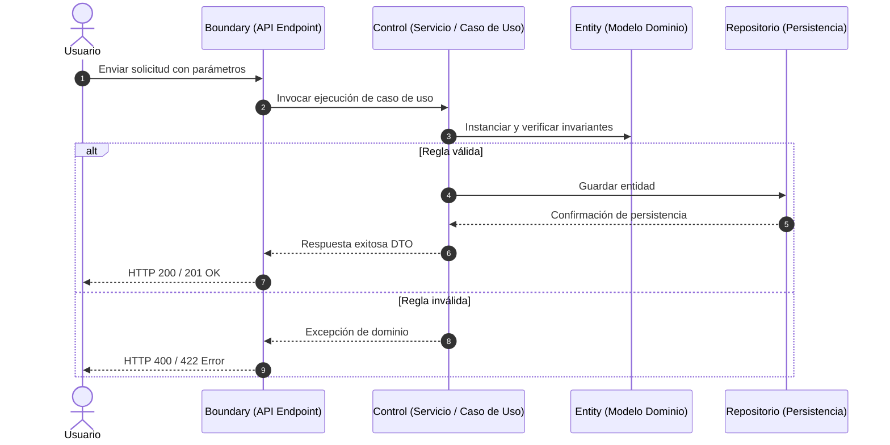

# Documento de Análisis y Diseño Dinámico - Metodología ICONIX

## 1. Modelo de Dominio
Entidades fundamentales del negocio y sus relaciones estructurales.

---

## 2. Análisis de Robustez (Robustness Analysis)
Conecta la especificación de caso de uso (IEEE 830) con el diseño de objetos clasificándolos en:
- **Boundary (Frontera):** UI o Endpoint.
- **Control (Controlador/Caso de Uso):** Orquestación de lógica.
- **Entity (Entidad):** Datos de negocio persistentes.

---

## 3. Diagrama de Secuencia
Flujo temporal de interacción entre los componentes diseñados.

